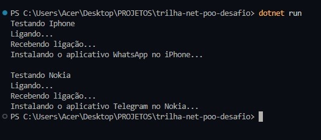

# 📱 Desafio POO - Smartphones


---

## 🚀 Sobre o Projeto
Este projeto foi desenvolvido como parte do **Desafio de Programação Orientada a Objetos (POO)** da **DIO (Digital Innovation One)**.  
O objetivo é simular o funcionamento de smartphones, aplicando os conceitos de **herança, abstração, encapsulamento e polimorfismo**.

Foram implementadas as seguintes classes:
- **Smartphone (abstrata)** → Classe base com propriedades e métodos comuns.
- **Iphone** → Herda de Smartphone e implementa suas próprias funcionalidades.
- **Nokia** → Também herda de Smartphone e possui comportamento próprio.

---

## 📂 Estrutura do Projeto

📦 trilha-net-poo-desafio <br>
┣ 📂 Models<br>
┃ ┣ 📜 Smartphone.cs<br>
┃ ┣ 📜 Iphone.cs<br>
┃ ┗ 📜 Nokia.cs<br>
┣ 📜 Program.cs<br>
┗ 📜 README.md<br>


---

## 🛠️ Tecnologias Utilizadas
- **C#**
- **.NET 9.0**
- Programação Orientada a Objetos (**POO**)

---

## ▶️ Como Executar

1. Clone este repositório:

   ```bash
   git clone https://github.com/seu-usuario/trilha-net-poo-desafio.git

2. Acesse a pasta do projeto:


   cd trilha-net-poo-desafio


3. Compile o projeto:


   dotnet build


4. Execute:


   dotnet run
   

---

## 📌 Exemplo de Saída no Console

<p align="center">
  
</p>


Testando Iphone
Ligando...
Recebendo ligação...
Instalando o aplicativo WhatsApp no iPhone...

Testando Nokia
Ligando...
Recebendo ligação...
Instalando o aplicativo Telegram no Nokia...

---

## 📄 Descrição do Projeto

**O Desafio POO - Smartphones** é um projeto desenvolvido em C# utilizando .NET 9.0, com foco em Programação Orientada a Objetos (POO).
O objetivo é simular o funcionamento de diferentes modelos de smartphones, aplicando conceitos como herança, abstração, polimorfismo e encapsulamento.

No projeto, a classe Smartphone funciona como base abstrata, contendo propriedades comuns (como número, modelo, IMEI e memória) e métodos universais (Ligar e ReceberLigacao).
As classes Iphone e Nokia herdam de Smartphone e implementam o método abstrato InstalarAplicativo, cada uma com seu comportamento específico.

O projeto também serve como exemplo prático de como organizar código orientado a objetos, testando métodos herdados e sobrescritos, e mostrando a aplicação do polimorfismo ao manipular diferentes tipos de smartphones através da classe base.

---

## ✨ Aprendizados

Aplicação prática de herança e abstração em C#.

Uso de métodos abstratos para forçar a implementação em classes filhas.

Demonstração de polimorfismo ao instanciar objetos da classe base (Smartphone) como Iphone e Nokia.

## 👩‍💻 Autora

Feito com 💜 por Samira 🚀

